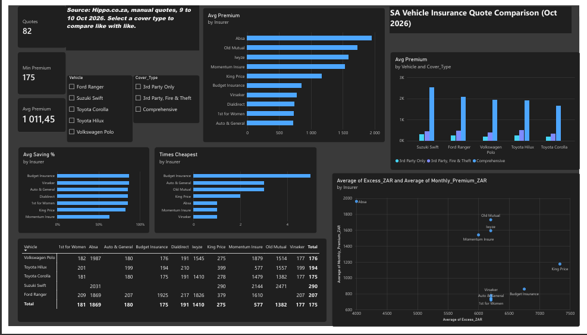

# Vehicle Insurance Quote Analysis (South Africa)

A comparison of comprehensive and third-party vehicle insurance quotes across South African insurers and popular vehicle models, built with Excel and Power BI.

## Objective
Identify the most affordable cover options across insurers and vehicles, and show how cover type and excess affect what a driver pays.

## Scope
- **Vehicles (all 2020 models):** Toyota Hilux 2.4 GD S, VW Polo GP 1.4 Trendline, Suzuki Swift 1.4 T Sport, Ford Ranger 2.0D XLT D/C A/T, Toyota Corolla 1.6 Quest
- **Cover types:** Comprehensive, 3rd Party Fire & Theft, 3rd Party Only
- **Insurers that returned quotes:** Absa, Auto & General, Budget Insurance, Dialdirect, 1st for Women, Virseker, Iwyze, King Price, Momentum Insure, Old Mutual
- **Result:** 82 real quotes (34 comprehensive, 24 third-party fire & theft, 24 third-party only)

## Methodology
1. Quotes collected manually from Hippo.co.za on 9 to 10 October 2026, using one fixed driver profile, address, parking setup and private use for every quote. No scraping.
2. Compiled in Excel with consistent naming. Insurers that did not return a price are recorded as N/A or Not recorded, never estimated.
3. Cleaned data and added calculated columns (annual premium, price rank, saving vs comprehensive).
4. Built an interactive Power BI dashboard.

## Key Findings
- **Cover type is the biggest price driver.** Average monthly premium was about R1,990 for comprehensive, R417 for third-party fire & theft, and R220 for third-party only.
- **Cheaper covers save about 82% to 87%** for most insurers compared with their own comprehensive quote for the same car.
- **The cheapest comprehensive insurer changed by car:** Old Mutual for the Hilux, Polo and Corolla, Absa for the Swift, and Momentum Insure for the Ranger. Some gaps were small (Hilux: R1,557 vs R1,558).
- **Premium vs excess:** Auto & General brands and Budget Insurance carried comprehensive excesses of R7,950 to R12,450, while Absa's was R4,000 and Momentum's R6,000.
- **King Price was the most expensive comprehensive quote** on every car where it was captured (average R2,899).
- **Budget Insurance was cheapest most often** across all car and cover combinations.

## Limitations
- One driver profile only (the author's), so the effects of age, gender and claims history are not measured.
- Quotes are indicative, from one comparison site, at one point in time.
- Insurers did not quote every car or cover type. Old Mutual and Iwyze returned comprehensive prices only, so averages across insurers are not like-for-like. Compare using one cover type at a time.
- Some quotes were not captured: King Price on the Polo (comprehensive) and most of the Corolla comprehensive list.
- The Swift quoted is the 1.4 T Sport, a performance variant, so its prices are higher than a standard Swift's.
- Small sample (82 quotes).

## Repository Structure
| Folder | Contents |
|---|---|
| `data/` | Quote workbook (raw and cleaned sheets) |
| `docs/` | Analysis summary |
| `dashboard/` | Power BI file and preview |

## Tools
Excel, Power BI

## Author
Brandon Mabaso
